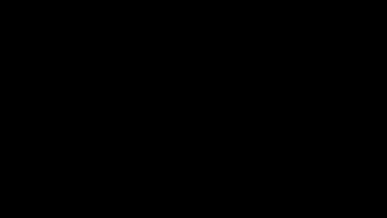

# HollywoodSaver



A native macOS menu bar app that turns your Mac into a video screensaver and **live wallpaper engine**. Play looping videos, GIFs, and built-in effects fullscreen — or run them behind your windows as a living desktop. Built with Swift, no Xcode project needed.

## Features

| Feature | Description |
|---------|-------------|
| **Screensaver Mode** | Fullscreen video, cursor hidden, dismiss with Escape/click/mouse |
| **Live Wallpaper Mode** | Ambient mode + reduced opacity = animated wallpaper behind all your windows |
| **Ambient Mode** | Play on any screen while you keep working — built-in, external, or all |
| **Multi-Screen** | Built-in, external, all screens — your choice |
| **Video + GIF** | Supports `.mp4`, `.mov`, `.m4v`, and `.gif` files |
| **Volume Slider** | Adjustable volume with mute toggle |
| **Opacity Slider** | Fade the video in ambient mode to see your desktop through it |
| **Loop** | Toggle looping on/off — play forever or just once |
| **Matrix Rain** | Built-in Matrix digital rain effect — no video file needed |
| **Matrix Settings** | Color theme, speed, characters, density, font size, trail length |
| **Shuffle** | Pick a random video from your collection |
| **Auto Play** | Automatically start playing when the app launches |
| **Launch at Login** | Start the app every time you log in |
| **Custom Icon** | Drop a `ranger.png` next to the app for a custom menu bar icon |
| **Organized Folders** | `videos/` and `gifs/` subfolders keep your media tidy |
| **Portable** | Move the whole folder anywhere — the app finds its videos |
| **Auto Update** | Checks GitHub for newer versions and offers one-click update with backup |
| **Break Reminder** | Countdown timer (60/45/30/15 min or custom) with fullscreen break screen overlay |
| **Floating Countdown** | On-screen countdown widget — choose screen, corner, color, and size |
| **Pomodoro Mode** | Auto-cycling work/break timer with configurable durations |
| **Break Sound** | Audible alert when break time arrives — 6 system sounds to choose from |
| **Session Stats** | Track breaks taken today and total — visible in the menu |
| **Lock Screen** | Password-protected screen lock — Cmd+Shift+L to lock, SHA-256 hashed password |
| **Show in Dock** | Toggle the app icon in the macOS Dock so you can see it alongside your other apps |
| **Desktop Shortcut** | Create a shortcut on your Desktop — never forget you have HollywoodSaver |
| **Rain Effects** | Two independent Matrix Rain modes — behind windows (wallpaper) and over windows (transparent overlay). Both fully click-through, with separate opacity sliders. Run one, the other, or both at once |
| **Sleep Timer** | Put your Mac to sleep now, after a timer (90/60/45/30/15 min), or after playback ends — resumes playback on wake |
| **Floating Clock** | Always-on-top clock overlay — 6 colors, 3 sizes, 4 corners, optional date, screen selection, auto-restore |
| **Secure Auto-Update** | Downloads pre-built releases from GitHub with SHA-256 checksum verification — no code compilation on your machine |
| **Contribute** | Buy Me a Coffee or Hodl H3LLCOIN — support the project from the menu |

> **v5.0.0 — Architecture Refactor Release.** Same feature set as v4.8.0, now living in a clean modular layout (14 source files in `src/`, `docs/`, `images/`, `videos/`, `gifs/` folders). Every feature from v1.0.0 through v4.8.0 remains free forever. Pro features (registration, advanced effects, Rangers token ecosystem) will arrive in a future release.

📖 **More docs:** [Full feature list & version history](docs/ABOUT.md) · [Complete changelog](docs/CHANGELOG.md)

## Quick Start

### Requirements

- macOS 15+ (Apple Silicon — M1/M2/M3/M4)
- Xcode Command Line Tools (`xcode-select --install`)

### Install

```bash
git clone https://github.com/davidtkeane/HollywoodSaver.git
cd HollywoodSaver
bash build.sh
```

`bash build.sh` does everything — compiles the app, generates the icon, and automatically launches it. No need to run `run.sh` separately.

### Where is the icon?

HollywoodSaver lives in the menu bar (the top bar of your screen, next to Wi-Fi, battery, etc.). The icon location depends on your Mac:

| Mac | Icon Location |
|-----|---------------|
| **M1 Macs** | Appears on the built-in screen menu bar AND external screen menu bar |
| **M3/M4 Macs** | If an external monitor is connected, the icon may **only** appear on the external screen's menu bar |
| **No external monitor** | Always appears on your main screen's menu bar |

If you don't see it, check the menu bar on your **external monitor**.

### Add Videos From Github

Download the included `hollywood.mp4` from the [Releases](https://github.com/davidtkeane/HollywoodSaver/releases) page, or add your own videos:

## Video From Mega Storage

**[Download hollywood.mp4 (113 MB)](https://mega.nz/file/qA1ATAjb#S3QLQOd6Mte46Z-j-HUu86iguSS_lMDUijeVXhwKCeo)** — Demo screensaver video hosted on MEGA

1. Drop `.mp4`, `.mov`, `.m4v` files into the `videos/` folder
2. Drop `.gif` files into the `gifs/` folder
3. Click the menu bar icon — your media appears automatically
4. That's it

Files in the root folder are also detected, so existing setups still work.

### Free Screensaver Videos

Looking for cool videos to use? Here are some great free sources:

- [Pexels](https://www.pexels.com/search/videos/screensaver+loop/) — 2,800+ free screensaver loops
- [Pixabay](https://pixabay.com/videos/search/screensaver/) — 700+ free 4K clips
- [Mixkit](https://mixkit.co/free-stock-video/loop/) — Curated free loop videos

## Live Wallpaper Mode


The real magic happens when you combine **Ambient Mode** with the **Opacity slider**. Lower the opacity and your video or effect plays *behind* all your windows — turning your desktop into a living, animated wallpaper.

**Try this:** Select Matrix Rain > Ambient > All Screens, then reduce the opacity. Matrix code rains behind your Finder windows, your terminal, your browser — on every monitor. You keep working while your desktop looks like you're inside the Matrix.

This works with any media — videos, GIFs, and built-in effects all become live wallpapers. On a dual-monitor setup, both screens get the effect simultaneously.

## Rain Effects

The **Rain Effects** submenu gives you two independent Matrix Rain modes:

| Mode | What It Does |
|------|-------------|
| **Rain Behind Windows** | Matrix Rain falls behind all your windows and icons — like an animated desktop wallpaper |
| **Rain Over Windows** | Transparent Matrix Rain falls in front of everything — fully click-through, you keep working while it rains code |

- Both modes can run **simultaneously** or independently
- Each has its **own opacity slider** (Behind: 0.1–1.0, Over: 0.05–0.5)
- **Stop All Rain** button to quickly turn everything off
- Both **auto-restore** when you relaunch the app
- Works across **all screens and Spaces**

**Try this:** Enable "Rain Over Windows" at low opacity (0.10–0.15) and keep coding. It's like working on a computer while looking through a rain-streaked window. Then add "Rain Behind Windows" too for the full immersion.

## How It Works

Click the helmet icon (or play icon) in your menu bar to see all your videos listed. Each video gives you options:

**Screensaver** — goes fullscreen and blocks everything like a real screensaver. Escape, click, or move the mouse to dismiss.

**Ambient (keep working)** — plays behind your desktop on any screen (built-in, external, or all) while your Mac stays usable. Toggle it off from the menu bar whenever you want.

### Settings

All settings are in the dropdown menu and persist between restarts:

- **Sound** — toggle audio on/off
- **Volume** — drag the slider
- **Opacity** — transparency for ambient mode
- **Rain Effects** — rain behind windows, over windows, or both (with separate opacity sliders)
- **Loop** — repeat forever or play once
- **Auto Play on Launch** — resume the last video automatically
- **Launch at Login** — start with macOS

## Sharing to Other Macs

Send the entire `HollywoodSaver` folder (app + videos) to another Mac. On the receiving Mac, remove the quarantine flag first:

```bash
xattr -cr ~/Desktop/HollywoodSaver
```

Then just open the app. Works on any Apple Silicon Mac (M1-M4) running macOS 15+.

## Project Structure

```
HollywoodSaver/
  README.md               # You are here
  build.sh                # Build script — creates the .app bundle
  run.sh                  # Launcher with terminal info
  src/                    # Swift source (14 files, ~3600 lines total)
    main.swift              # App startup
    AppDelegate.swift       # Main controller (~2500 lines)
    Prefs.swift             # UserDefaults wrapper
    MatrixConfig.swift      # Matrix Rain config enums
    MatrixRainView.swift    # Matrix Rain rendering
    VideoPlayerView.swift   # AVPlayer-based video playback
    GifPlayerView.swift     # Frame-by-frame GIF animation
    LockScreen.swift        # Lock overlay + password screen
    BreakReminderView.swift # Break screen overlay
    ClockOverlayView.swift  # Floating clock display
    CountdownOverlayView.swift
    SliderMenuView.swift    # Volume slider menu item
    InputMonitor.swift      # Global/local event monitoring
    ScreensaverWindow.swift # Custom NSWindow + protocol
  images/                 # App logo and screenshots
    ranger.png              # App logo / menu bar icon source
    thematrix.png           # Matrix Rain screenshot
  docs/                   # Project documentation
    ABOUT.md                # Full feature list + version history
    CHANGELOG.md            # All release notes v1.0 → v5.0
  videos/                 # Drop .mp4, .mov, .m4v files here
  gifs/                   # Drop .gif files here
  release/                # 🎖️ Maintainer-only — you don't need to touch this
    release.sh              # Publishes GitHub Releases (maintainer workflow)
  HollywoodSaver.app/     # Built app (generated by build.sh)
```

> **🎖️ Note on `release/`** — This folder contains the release automation script used only by the project maintainer to publish new versions to GitHub. **Regular users never need to run anything in `release/`** — just `bash build.sh` and you're set.

Pure Swift compiled with `swiftc` — no Xcode project, no dependencies, no frameworks beyond what ships with macOS.

## Building

```bash
bash build.sh
```

This creates the `.app` bundle with Info.plist, compiles all Swift sources in `src/`, generates the app icon from `images/ranger.png`, and code-signs it ad-hoc.

## ☕ Support the Project

Love HollywoodSaver? Two ways to show it:

### Buy Me a Coffee
[](https://buymeacoffee.com/davidtkeane)

---

### 🪙 Buy H3LLCOIN — Join the Community

H3LLCOIN is the Rangers community coin on Solana. Buying a coin makes you part of the community and helps fund free open source tools like HollywoodSaver.

| | |
|---|---|
| 🌐 **Official site** | [h3llcoin.com](https://h3llcoin.com/) |
| 🔄 **Buy instantly** | [Jupiter Swap → H3LL](https://jup.ag/swap?sell=So11111111111111111111111111111111111111112&buy=BJP255e79kNzeBkDPJx8Dkgep32hwF56e1UCWKdBCvie) |
| 📋 **Contract address** | `BJP255e79kNzeBkDPJx8Dkgep32hwF56e1UCWKdBCvie` |

**How to buy in 3 steps:**
1. Get SOL on [Coinbase](https://coinbase.com), [Binance](https://binance.com), or [Kraken](https://kraken.com)
2. Transfer SOL to your [Phantom wallet](https://phantom.app)
3. Click the Jupiter Swap link above — H3LL is pre-loaded, just confirm the swap

Your support funds accessibility tools for 1.3 billion people worldwide. 🎖️

**Rangers lead the way!** 🎖️

---

## License

MIT — do whatever you want with it.

---

## Credits

**Created by:**
- **David Keane** ([@davidtkeane](https://github.com/davidtkeane)) — IrishRanger 🎖️
  - Cybersecurity Master's student (Year 1)
  - Psychology BSc | TryHackMe Top 8%
  - Building RangerOS for accessibility
  - Creator of H3LLCOIN

**Built with:**
- **[Claude Code](https://claude.ai/claude-code)** — AI pair programming
- **AIRanger** (Claude Opus 4.6) — Your AI Ops Commander 🎖️

**Part of the Rangers ecosystem:**
- 🪙 [H3LLCOIN](https://h3llcoin.com/) — Cryptocurrency for Rangers
- 🎖️ RangerOS — Accessibility-first security platform
- 🔗 RangerBlock — P2P blockchain network

---

*Built with Swift and Rangers spirit* 🎖️
